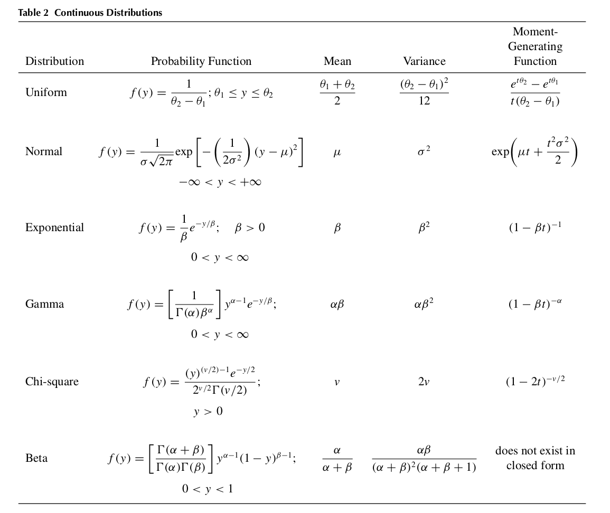

# Math 324 Summery, Fall 2017 McGill, By Andre Kaba

## **Review Chapter (crap)**

### CDF defination

$$F(x)=\int_{-\infty}^{x}f(t)dt, \forall x \in \mathbb{R}$$
Where

$\int_{-\infty}^{\infty}f(x)dx=1$

$f(x)\geq 0 \**forall** x$

* The sample counter part of pdf is **histogram**

### Sample average

* $$\overline{X_n}=\frac{1}{n}\sum_{i=1}^{n} X_i$$

* it's used to estimate $\mu$

### Sample variance

* $$ S^2_n=\frac{1}{n-1} \sum_{i=1}^{n}(X_i-\overline{X_n})$$
* it's used to estimate $\sigma^2$

### Moment generating function for $X \sim F(\theta)$ ($X$ follows some distribution with some parameters)

* $M(t)=E[e^{tX}], t\leq h$ for some $h>0$
* Can be used to compute the moments of $X$. i.e $E[X^k]=M^{(k)}(0), k=1,2...$

### Weak law of large numbers

* For $X_1,X_2,X_3,...$ i.d.ds with $E[X_i]=\mu$ and $Var(X_i)=\sigma^2<\infty$ then we have:

    $$\lim_{n \rightarrow \infty} P(|\overline{X_n}-\mu|>\epsilon)=0$$
    for some $\epsilon>0$, i.e $X \xrightarrow{p} \mu$, as $n\rightarrow \infty$
* this can be proved using Tchebysheff:

    $$P(|X-\mu|\geq k\sigma)\leq \frac{1}{k^2}$$

---

\pagebreak

## **Sampling**

### **Statistic:**

* It's a function of only the random sample, i.e

    $$T(X_1,X_2,...):\mathbb{S}\rightarrow \mathbb{R}^d$$
    where $d\geq 1$ and $\mathbb{S}$ is the sample space.

* It's a random variable and have a distribution called **sampling distribution** which depend on the type of statistic, distribution of $X_i$'s and the size $n$

### **Range:**

$R_n(X_1,X_2,...,X_n)=X_{(n)}-X_{(1)}$

### **Linear combination of Normal variables (Theorm 6.3):**

* We have $X_i \sim N(\mu_i,\sigma_i^2)$ for $i=1,2,...n$

    $$Y_n=\sum_{i=1}^{n} a_i X_i \sim N\left(\sum_{i=1}^{n} a_i \mu_i,\sum_{i=1}^{n} a_i^2\sigma_i^2 \right)$$
* We can conclude that $\overline{X_n} \sim N(\mu,\frac{\sigma^2}{n})$ for Normal vars $X_i$'s

* Notice that as $n \rightarrow \infty$, $Var(\overline{X_n})\rightarrow 0$, this means that $\overline{X_n}$ converges in probability to $\mu$

### **Linear combination of squared standard variables (Theorm 6.4):**

* We have $X_i\sim N(\mu_i,\sigma_i^2)$ and $Z_i=\frac{X_i-\mu_i}{\sigma_i} \sim N(0,1)$ for $i=1,2,...n$

    $$\sum_{i=1}^{n} Z_i^2 \sim \chi^2_{(n)}$$

* Notice the special case where $X_i \sim N(\mu,\sigma^2)$ and $Z_i=\frac{X_i-\mu}{\sigma}$ then:

    $$\sum_{i=1}^{n} Z_i^2=\frac{1}{\sigma^2}\sum_{i=1}^{n}(X_i-\mu)^2 \sim \chi^2_{(n)}$$

### **Sampling distro of sample variance (Theorm 7.3):**

* We have $X_i\sim N(\mu_i,\sigma_i^2)$

    $$\frac{(n-1)S^2_n}{\sigma^2}=\frac{1}{\sigma^2}\sum_{i=1}^{n} (X_i-\overline{X_n})^2 \sim \chi^2_{(n-1)}$$

* Moreover, $\overline{X_n}$ and $S_n^2$ are independent.
* Notice how we lose one degree of freedom when we use $\overline{X_n}$ instead of $\mu$
* And we conclude that $E[S^2_m]=\sigma^2,Var(S^2_n)=\frac{2\sigma^4}{n-1}$
* Notice that $S_n^2\xrightarrow{p}\sigma^2$ as $n\rightarrow \infty$,this means that $S_n^2$ converges in probability to $\sigma^2$

### **Student Distro (Defination 7.2):**

* if $Z \sim N(0,1), W \sim \chi^2_{(r)}$ and $Z$ and $W$ are independent then:

    $$T=\frac{Z}{\sqrt{W/r}} \sim t_{(r)}$$
    where $t_{(r)}$ is student distribution with $r$ degrees of freedom.

* Student distro can be constructed from bunch of normal samples $X_1,X_2,...X_n \sim N(\mu,\sigma^2)$

    $$T_{n}=\frac{\sqrt{n}(\overline{X_n}-\mu)}{S_n}\sim t_{(n-1)}$$

### **Fisher-Snedecor Distro:**

* If $W_1 \sim \chi^2_{(r_1)}$ and $W_2 \sim \chi^2_{(r_2)}$ are independent then:

    $$F=\frac{W_1/r_1}{W_2/r_2} \sim F(r_1,r_2)$$
    Where $F(r_1,r_2)$ is Fisher distro with $(r_1,r_2)$ degrees of freedom.

* Note that $F \sim F(r_1,r_2) \implies \frac{1}{F} \sim F(r_2,r_1)$

### **Comparing two sample variances:**

* Take $X_1,...,X_n \sim N(\mu_1,\sigma_1^2)$ and  $Y_1,...,Y_m \sim N(\mu_2,\sigma_2^2)$ then:

    $$\frac{S^2_n/\sigma_1^2}{S^2_m/\sigma_2^2} \sim F_{(n-1,m-1)}$$

### **Central limit theorm (theorm 7.4):**

* Let $X_1,...,X_n$ samples (not necessarly independent) from an arbitrary distribution $F$ with $E[X_i]=\mu$ and $Var(X_i)=\sigma^2 < \infty$, define a new R.V as follows:

    $$U_n =\frac{\overline{X_n}-\mu}{\sigma/\sqrt{n}}$$
     Then as $n \rightarrow \infty, \forall x \in \mathbb{R}$

    $$F_n(x)=P(U_n \leq x) \rightarrow \Phi(x)=\int_{-\infty}^{x} \frac{1}{\sqrt{2\pi}}e^{-\frac{t^2}{2}}dt$$

* This means that the CDF will turn into a normal CDF when $n$ is large, we say $U_n$ converges in distribution to $N(0,1)$ and we write $U_n \xrightarrow{d} N(0,1)$

* This theorm implies that $\overline{X_n} \approx N(\mu,\sigma^2/n)$ when $n$ is large without having the $X_i$'s themselves being normal in the first place as long as $0<Var(X_i)=\sigma^2<\infty$

### **Slutsky's Theorm:**

* Let $X_1,X_2,...$ and $Y_1,Y_2,...$ be two sequences of R.V's such that as $n \rightarrow \infty$, $X_n \xrightarrow{d} X$ and $Y_n \xrightarrow{p} c$ for some constant c, then as $n \rightarrow \infty$:

    1) $X_n+Y_n \xrightarrow{d} X+c$
    1) $(X_n)(Y_n) \xrightarrow{d} (X)(c)$
    1) if $c\neq 0, X_n/Y_n \xrightarrow{d} X/c$

### **$S_n$ version of CLT (fourth moment theorm):**

* Let $X_1,...,X_n$ be R.V from some disro $F$. In addition, this version require that $E(X_i^4)<\infty$ as $n\rightarrow \infty$, then:

    $$W_n=\frac{\overline{X_n}-\mu}{S_n/\sqrt{n}} \xrightarrow{d} N(0,1)$$
* note that $W=\frac{\sqrt{n}(\overline{X_n}-\mu)}{S_n}$, thus if $X_i \sim N(\mu,\sigma^2)$ then $W_n \sim t_{(n-1)}$ as $n \rightarrow \infty$

---

\pagebreak

## **Point Estimation**

### **Point Estimator of some parameter $\theta$:**

* it's a statistic of the data $\hat{\theta}=T(X_1,X_2,...,X_n)$

### **Common point estimator**

### **Bias for some estimator $\hat{\theta_n}$:**

* The bias is $B(\hat{\theta_n})=E[\hat{\theta_n}]-\theta$
* $\hat{\theta_n}$ is unbiased if $B(\hat{\theta_n})=0$ or asymptotically unbiased if $\lim_{n \rightarrow \infty} B(\hat{\theta_n})=0$

### **Consistency for some estimator $\hat{\theta_n}$:**

* the estimator is consistant if $\lim_{n\rightarrow \infty} Var(\hat{\theta_n})=0$
* Or we can say $\lim_{n \rightarrow \infty} P(|\hat{\theta_n}-\theta|>\epsilon)=0$ for any $\epsilon > 0$ , i.e $\hat{\theta_n} \xrightarrow{p} \theta$ as $n \rightarrow \infty$

    We also can say $\lim_{n \rightarrow \infty} P(|\hat{\theta_n}-\theta|\leq \epsilon)=1$ which is easier for problem solving.

* thus by weak law of large numbersc $\overline{X}_n$ is consistant estimator of $\mu$ and $\hat{p}=\frac{Y}{n}$ is a consistant estimator of $p$ (proporation). Since we have this:

    $$U_n \xrightarrow{p} U, W_n \xrightarrow{p} W \implies U_n+W_n \xrightarrow{p} U+W$$

    Then $\overline{X}_{n_1} -\overline{X}_{n_2}$ is consistant estimator for $\mu_1 -\mu_2$ and $\hat{p_1}-\hat{p_2}=\frac{Y_1}{n_1}-\frac{Y_2}{n_2}$ is a consistant estimator for $p_1- p_2$

### **Mean squared error of an estimator $\hat{\theta_n}$ (combining both bias and variance)**

* $MSE(\hat{\theta_n})=E\left[(\hat{\theta}_n-\theta)^2\right]=Var(\hat{\theta}_n)+[B(\hat{\theta}_n)]^2$
* we want $MSE$ to be as small as possible.

### **Notes about $Y=Min(X_1,X_2,...,X_n):$ when $X_i \sim Exp(\frac{1}{\beta})$**

* Construct the CDF as follows:

    $F(y)=P(Y\leq y)=1-P(Y\geq y)=1-P(Min(X_1,X_2,...,X_n)\geq y)=P(X_1\geq y,X_2\geq y,...,X_n\geq y)$

    $=1-P(X_1\geq y)P(X_2\geq y)...P(X_n\geq y)$

    $=1-e^{-y/\beta}e^{-y/\beta}...e^{-y/\beta}=1-e^{-n\frac{1}{\beta}}$

    Thus $Y \sim Exp(\frac{n}{\beta})$

### **Relative efficiency (defination 9.1)**

* $eff(\hat{\theta}_n,\widetilde{\theta}_n)=\frac{Var(\widetilde{\theta}_n)}{Var(\hat{\theta}_n)}$

### **Notes about $Y=Max(X_1,X_2,...,X_n):$ when $X_i \sim Uni[a,b]$:**

* Construct the CDF as follows:

    $F(y)=P(Y\leq y)=P(Max(X_1,X_2,...,X_n)\leq y)$

    $=P(X_1\leq y,X_2 \leq y, ... , X_n \leq y)$

    $=\prod_{i=1}^{n} P(X_i \leq y)$

    That was general, in case of $uniform[a,b]$ the product is $\left(\frac{y-a}{b-a}\right)^n$

    So the pdf of $Y=max(X_1,X_2,...,X_n)$ where $X_i \sim uni[0,
    \theta]$ is $f(y)=\frac{ny^{n-1}}{\theta^n}$ for $y \in [0,\theta]$

### **Two consistant estimators rules:**

* if $\hat{\theta}_n$ is consistant to $\theta$ and $\hat{\theta'}_n$ is consistant to $\theta'$ then:
    * $\hat{\theta}_n+\hat{\theta'}_n$ is consistant (converges in probability) to $\theta+\theta'$
    * $\hat{\theta}_n.\hat{\theta'}_n$ is consistant (converges in probability) to $\theta. \theta'$
    * if $\theta'\neq 0$, $\hat{\theta}_n/\hat{\theta'}_n$ is consistant (converges in probability) to $\theta/\theta'$
    * if $g(.)$ is real valued and continues function at $\theta$, then $g(\hat{\theta_n})$ is consistant (converges in probability) to $g(\theta)$

### **Sufficient estimators:**

* if we have random samples $X_1,...,X_n$ from distribution $f(.;\theta)$ with $\theta$ as a unknown parameter. We say that the statistic $T(X_1,...,X_n)$ is sufficent if the conditional distro of $X_1,...,X_n$ given $T$ does **not** depend on $\theta$

* One possible tool for finding suffcient statistics is the likelihood function which is the joind pdf of having values $x_1,x_2,...,x_n$ given $\theta$.

$$L(x_1,x_2,...,x_n;\theta)=f(x_1;\theta)f(x_2;\theta)...f(x_n;\theta)$$

* Note: we can think about the likelihood function in the discrete case as the probability of observing $X_1=x_1,X_2=x_2,...,X_n=x_n$

### **Fisher-nayman factorization theorm**

* if we have random samples $X_1,...,X_n$ from distribution $f(.;\theta)$, then the statistic $T(X_1,...,X_n)$ is sufficient for $\theta$ if and only if:

    $$L(x_1,x_2,...,x_n;\theta)=g(t;\theta).h(x_1,x_2,...,x_n)$$
    where $t=T(X_1,...,X_n)$, $g$ depend on $x_i$'s only through $t$ and $h$ doesn't depend on $\theta$

* The multi-class version would have $\theta=(\theta_1,\theta_2,...,\theta_d)$ and we have $T_1(X_1,...,X_n),...,T_n(X_1,...,X_n)$ are sufficient for $\theta$ if and only if:

    $$L(x_1,x_2,...,x_n;\theta)=g(t_1,t_2,...,t_d;\theta).h(x_1,x_2,...,x_n)$$
    where $t_j=T_j(X_1,...,X_n)\forall 1\leq j\leq d$, $g$ depend on $x_i$'s only through $t_j;\forall 1\leq j\leq d$ and $h$ doesn't depend on $\theta$

### **Minimal suffcient statistic:**

* Let $T=T(X_1,X_2,...,X_n)$ be a sufficient statistic for a parametric family. The $T$ is minimal sufficient statistic if and only if for any other sufficient statistic $U=U(X_1,X_2,...,X_n)$, there exist a function $g(.)$ such that $T=g(U)$

* Here both $U$ and $T$ are minimal sufficient statistics, thus $g(.)$ have to be one-to-on. And the minimal sufficient statistic is unique.

### **Lehmann–Scheffé Criterion:**

* $T$ is minimal sufficient statistic if for any two sample points $(x_1,...,x_n)$ and $(y_1,...,y_n)$

    $\frac{L(x_1,...,x_n;\theta)}{L(y_1,...,y_n;\theta)}$
    does not depend on $\theta \iff T(x_1,...,x_n)=T(y_1,...,y_n)$

* solution steps:
    * Write the fraction
    * Take it for more than one point (sum the $x_i$'s)
    * Then try to make it doesn't depend on the parameter and you will get a statistic of the samples that satisfy that which will be the minimals sufficient statistic.

* Note: minimal sufficient statistic for $N(\mu,\sigma^2)$ are $\sum x_i$ for $\mu$ and $\sum x_i,\sum x_i^2$ for $\sigma^2$

* Note: minimal sufficient statistic for $Bin(n,p)$ are $\sum x_i$ 

### **Rao-Blackwell Theorm:**

* if $\hat{\theta}_n$ is unbiased estimator for $\theta$ such that $Var(\hat{\theta}_n)< \infty$. If we have the sufficient statistic $T$ for $\theta$ then the statistic:

    $$\widetilde{\theta}_n=E(\hat{\theta}_n|T)$$
    Is an unbiased estimator of $\theta$ with $Var(\widetilde{\theta}_n)\leq Var(\hat{\theta}_n)$

* The theorm give us a way to get a better estimators from other ones using sufficient statistics.

* Notice that $\hat{\theta}_n$ must not be a function of $T$ otherwise $E(\hat{\theta}_n|T)=\hat{\theta}_n$, hence applying Rao-blackwell multiple times is useless.

### **Minimum variance unbiased estimators (MVUE):**

* An estimator $\hat{\theta}_n$ is an MVUE if:
    1) $\hat{\theta}_n$ is unbiased
    1) $\hat{\theta}_n= g(T)$ where $T$ is MSS

---

\pagebreak

## **Interval Estimation**

The goal is to compute two (or one) statistics for a parameter $\theta$, $\hat{\theta}_L,\hat{\theta}_U$ with a confidence level specified.

* Two sided $1-\alpha$ confidence interval $\implies P(\hat{\theta}_L \leq \theta \leq \hat{\theta}_u)=1-\alpha$

* Upper one sided $1-\alpha$ confidence interval $\implies P( \theta \leq \hat{\theta}_u)=1-\alpha$

* Lower one sided $1-\alpha$ confidence interval $\implies P(\hat{\theta}_L \leq \theta )=1-\alpha$

Where $1-\alpha$ is the required confidence

### **The pivotal method**

We try to construct a quantity $Q$ from the data and the parameter of interest and hopefully we would know it's distribution then we use it's quantiles $q_\alpha$to write:

$$P(q_{1-\alpha/2} \leq Q \leq q_{\alpha/2})=1-\alpha$$

Then we solve for the parameter of interest, easy peasy! :)

### **Common pivots for Normal distributions**

* $\theta$ in $X_i \sim Uni(0,\theta) \implies \left(\frac{Y_{(n)}}{\theta}\right)^n \sim Uni(0,1)$ where $Y_{(n)}$ have CDF $P(Y_{(n)} \leq y)=\left(\frac{y}{\theta}\right)^n, 0\leq y \leq \theta$

* $\mu$ in $X_i \sim N(\mu,1) \implies \frac{\overline{X}-\mu}{1/\sqrt{n}} \sim N(0,1)$

* $\mu$ in $X_i \sim N(\mu,\sigma^2) \implies \frac{\overline{X}-\mu}{S_n/\sqrt{n}} \sim t_{(n-1)}$

* $\mu_1-\mu_2$ in $X_i \sim N(\mu_1,\sigma^2), Y_i \sim N(\mu_2,\sigma^2)$ where $X_i,Y_i$ are **i.i.d**

    $\implies \frac{(\overline{X}-\overline{Y})-(\mu_1-\mu_2)}{S_{pooled}\sqrt{\frac{1}{n}+\frac{1}{m}}} \sim t_{(n+m-2)} \text{ where } S_{pooled}=\frac{1}{n+m-2}\left[\sum_{i=1}^n (X_i-\overline{X}_n)^2+\sum_{i=1}^m (Y_i-\overline{Y}_m)^2\right]$
    * **Note:** $\frac{(n+m-2)S_{pooled}}{\sigma^2}\sim \chi^2_{(n+m-2)}$

* $\sigma$ in $X_i \sim N(\mu,\sigma^2) \implies \frac{(n-1)S^2_n}{\sigma^2} \sim \chi^2_{(n-1)}$
    * Note that $\chi^2_{(r)}$ is not symmetric so watch out while estimating

### **Common pivots for non-Normal distributions for large $n$ (using CLT)**

* General idea is to approximate using a consistant estimator $\hat{\theta}$ as follows:

$$\frac{\hat{\theta}-\theta}{\hat{\sigma}_{\hat{\theta}}} \xrightarrow{d} N(0,1)$$

* $\mu$ in $X_i \sim N(\mu,\sigma^2)$ with $\mathbf{E(X^4)<\infty}$ $\implies \frac{\overline{X}-\mu}{S_n/\sqrt{n}} \sim N(0,1)$

* $\mu_1-\mu_2$ in $X_i \sim N(\mu_1,\sigma^2)$ and $Y_i \sim N(\mu_2,\sigma_2^2)$ with $X_i,Y_i$ **i.i.d** $\implies \frac{(\overline{X}_n-\overline{Y}_m)-(\mu_1-\mu_2)}{\sqrt{\frac{\sigma^2_1}{n}+\frac{\sigma^2_2}{m}}} \sim N(0,1)$

* $p$ in $X_i \sim Bern(p)$ and **i.i.d** with $\hat{p}_n=\overline{X}_n=\frac{1}{n}\sum_{i=1}^n X_i$ $\implies \frac{\hat{p}_n-p}{\sqrt{\hat{p}(1-\hat{p})/n}} \sim N(0,1)$
    * Note: $\hat{p}_n \xrightarrow{p} p$

* $p_1-p_2$ in $X_i \sim Bern(p_1),Y_i \sim Bern(p_2)$ and **i.i.d** with $\hat{p_1}_n=\overline{X}_n,\hat{p_2}_m=\overline{Y}_m$ $\implies \frac{(\hat{p_1}_n-\hat{p_2}_m)-(p_1-p_2)}{\sqrt{\hat{p}_1(1-\hat{p}_1)/n+\hat{p}_2(1-\hat{p}_2)/m}} \sim N(0,1)$

### **Approximating using MLE Theory**

### Intervals interpretation

* If the interval is concrete i.e $[a,b]$ with $95\%$ we say:
    * If we repeat this experiment 100 times we expect $95\%$ of these intervals to contain $\theta$
    * The prexperiment CI that lead to these values has $95\%$ chance of containing $\theta$

---

\pagebreak

## **Model fitting**

### **Method of Moments:**

* If we need to estimate $d$ parameters we solve the following system of equations.

    $$m_k=E(X^k), k=1,2,...,d$$
    where

    $m_k=\frac{1}{n}\sum_{i=1}^{n}X_i^k$
    $E[X^k]=\sum_{i=1}^{n}x^kf(x;\theta)$ **or** $E[X^k]=\int_{-\infty}^{\infty}x^kf(x;\theta)$

* This method is shitty and can produce biased estimators.

### **MLE**

* we compute $\hat{\theta}_n=argmax_{\theta \in \Theta} ln[L(\theta)]$, it's often a function of MSS by factorization theorm and if it's biased we fix it to obtain a MVUE
* Invariance prop: if $\hat{\theta}_n$ is MLE for $\theta$ then $\tau(\hat{\theta}_n)$ is a MLE of $\tau(\theta)$
* regualar conditions and large sample: $\sqrt{n}(\hat{\theta}_n-\theta) \xrightarrow{d} N(0,I^{-1}(\theta))$, $I^{-1}(\theta)=-E\left[\frac{\partial^2 \ln f(X;\theta)}{\partial \theta^2}\right]=-\sum_{i=1}^{n} \frac{\partial^2}{\partial \theta^2}\ln f(x_i;\theta)$ is fisher info matrix

---

\pagebreak

## **Hypothesis Testing**

### Elements fot the test

* Null hypothesis $H_0:\theta \in \Theta_0$
* Alternate hypothesis $H_a:\theta \in \Theta_a$
* Test Statistic $Y$
* Rejection region $RR$, the values of $Y$ where we rejct $H_0$

### **Errors**

1) Type I error (FN) : when $H_0$ is rejected but it's true with probability $\alpha$
1) Type II error (FP) : when $H_0$ is accepted but $H_a$ is true with probability $\beta$

* Note 1: $\beta$ depends on the real value of $p$ and the further this value from $p_0$ the small $\beta$ will be.

* Note 2: $\beta$ will decrease as the sample size gets larger cuz we get better estimates of $\theta$ to use against the null hypothesis

### Changing $RR$

When we change $RR$ to $RR^*$ such that $RR \subseteq RR^*$ we get:

* $\alpha^* \geq \alpha$, Type I error goes up
* $\beta^* \leq \beta$, Type II error goes down

### Minimizing error

We usually aim to minimize the linear combination of errors for some test $\delta$ by minimizing:

$$a\alpha+b\beta$$

Where $a,b>0$

### Large sample problems $(n\geq30)$

1) $H_0:\theta=\theta_0$
1) $$ H_a : \left\{
        \begin{array}{ll}
            \theta >\theta_0 & \quad \text{Upper tail alternative hypo} \\
            \theta < \theta_0 & \quad \text{Lower tail alternative hypo} \\
            \theta \neq \theta_0 & \quad \text{Two tail alternative hypo}
        \end{array}
    \right.
    $$
1) Test statistic:

    $$Z=\frac{\hat{\theta}-\theta_0}{\sigma_{\hat{\theta}}}$$

1) $$ RR : \left\{
        \begin{array}{ll}
            \{z > z_{\alpha}\}    & \quad \text{Upper tail RR} \\
            \{z < -z_{\alpha}\}  & \quad \text{Lower RR} \\
            \{|z| > z_{\frac{\alpha}{2}}\} & \quad \text{Two tail RR}
        \end{array}
    \right.
    $$

1) **(Optional)** if the researcher want $\beta(\theta_a);\theta_a>\theta_0$, i.e Type II error for specific $\theta_a$ with $RR:\{\hat{\theta}>k\}$ we do

    $$\beta(\theta_a)=P(\hat{\theta} \leq k \text{ when } H_a \text{ is true})=P(\hat{\theta} \leq k \text{ when } \theta=\theta_a)=P\left(\frac{\hat{\theta}-\theta_a}{\sigma_{\hat{\theta}}}\leq \frac{k-\theta_a}{\sigma_{\hat{\theta}}} \text{ when } \theta=\theta_a \right)$$
    * find $k$ by getting $RR:\{\hat{\theta}>k\}$ then use the previous formula, of course watch out that this is only for upper tail.

1) **(Optional)** if the researcher want to know what sample size is required for specific values of $\alpha$ and $\beta$ we compute:

    $$n=\frac{(z_{\alpha}+z_{\beta})^2\sigma^2}{(\mu_a - \mu_0)^2}$$

#### Examples for large samples $(n\geq 30)$

Here $Z \sim N(0,1)$

1) $\sum_{i=1}^{n} X_i=X \sim N(\mu,\sigma^2) \implies \text{ test statistic } Z=\frac{\overline{X}-\mu_0}{S_n/\sqrt{n}}$

1) $\sum_{i=1}^{n_1} X_i=X \sim N(\mu_1,\sigma^2_1) \text{ and } \sum_{i=1}^{n_2} Y_i=Y \sim N(\mu_2,\sigma^2_2) \text{ and } X_i,Y_i$ are independent

    $\implies \text{ test statistic } Z=\frac{\overline{X}-\overline{Y}}{\sqrt{\frac{S^2_{n_1}}{n_1}+\frac{S^2_{n_2}}{n_2}}}$

1) $\sum_{i=1}^{n} X_i=X \sim Bin(n,p) \implies \text{ test statistic } Z=\frac{\hat{P_n}-P_0}{\sqrt{\frac{p_0q_0}{n}}}$

1) $\sum_{i=1}^{n_1} X_i=X \sim Bin(n_1,p_1) \text{ and } \sum_{i=1}^{n_2} Y_i=Y \sim Bin(n_2,p_2) \text{ and } X_i,Y_i$ are independent

    $\implies \text{ test statistic } Z=\frac{\hat{P}_1-\hat{P}_2}{\sqrt{\hat{P}(1-\hat{P})(\frac{1}{n_1}+\frac{1}{n_2})}} \text{ where } \hat{P}=\frac{X+Y}{n_1+n_2},\hat{P}_1=\frac{X}{m},\hat{P}_2=\frac{1}{n}$

### Small sample problems

#### Small sample test for $\mu$

Assuming $Y_1,Y_2,...,Y_n$ are samples from Normal where $E[Y_i]=\mu$ and $\sigma$ is unknown

1) $H_0:\mu=\mu_0$
1) $$ H_a : \left\{
        \begin{array}{ll}
            \mu >\mu_0 & \quad \text{Upper tail alternative hypo} \\
            \mu < \mu_0 & \quad \text{Lower tail alternative hypo} \\
            \mu \neq \mu_0 & \quad \text{Two tail alternative hypo}
        \end{array}
    \right.
    $$
1) Test statistic:

    $$T=\frac{\overline{Y}-\mu_0}{S/\sqrt{n}}$$

1) $$ RR : \left\{
        \begin{array}{ll}
            \{t > t_{\alpha}\}    & \quad \text{Upper tail RR} \\
            \{t < -t_{\alpha}\}  & \quad \text{Lower RR} \\
            \{|t| > t_{\frac{\alpha}{2}}\} & \quad \text{Two tail RR}
        \end{array}
    \right.
    $$
    Note: $T \sim \chi^2_{(n-1)}$

#### Small sample test for $\mu_1-\mu_2$

Assuming $X_1,X_2,...,X_{n_1}$ and $Y_1,Y_2,...,Y_{n_2}$ are samples from Normal where $E[X_i]=\mu_1$, $E[Y_i]=\mu_2$ and $\sigma^2_1=\sigma^2_2$ (note $\sigma_1$ and $\sigma_2$ are unknowns)

1) $H_0:\mu_1-\mu_2=D_0$
1) $$ H_a : \left\{
        \begin{array}{ll}
            \mu_1-\mu_2> D_0 & \quad \text{Upper tail alternative hypo} \\
            \mu_1-\mu_2< D_0 & \quad \text{Lower tail alternative hypo} \\
            \mu_1-\mu_2 \neq D_0 & \quad \text{Two tail alternative hypo}
        \end{array}
    \right.
    $$
1) Test statistic:

    $$T=\frac{\overline{Y}_1-\overline{Y}_2-D_0}{S_p\sqrt{\frac{1}{n_1}+\frac{1}{n_2}}} \text{ where } S_p=\sqrt{\frac{(n_1-1)S^2_1+(n_2-1)S_2^2}{n_1+n_2-2}}$$

1) $$ RR : \left\{
        \begin{array}{ll}
            \{t > t_{\alpha}\}    & \quad \text{Upper tail RR} \\
            \{t < -t_{\alpha}\}  & \quad \text{Lower RR} \\
            \{|t| > t_{\frac{\alpha}{2}}\} & \quad \text{Two tail RR}
        \end{array}
    \right.
    $$

    Note: $T \sim \chi^2_{(n_1+n_2-2)}$

### **Test for population Variances**

#### test a specific value $\sigma_0$

Assuming $Y_1,Y_2,...,Y_n$ are samples from Normal where $E[Y_i]=\mu$ and $Var(Y_i)=\sigma^2$

1) $H_0:\sigma^2=\sigma_0^2$
1) $$ H_a : \left\{
        \begin{array}{ll}
            \sigma^2 >\sigma^2_0 & \quad \text{Upper tail alternative hypo} \\
            \sigma < \sigma_0 & \quad \text{Lower tail alternative hypo} \\
            \sigma \neq \sigma_0 & \quad \text{Two tail alternative hypo}
        \end{array}
    \right.
    $$
1) Test statistic:

    $$\chi^2=\frac{(n-1)S^2}{\sigma_0}$$

1) $$ RR : \left\{
        \begin{array}{ll}
            \{\chi^2 > \chi^2_{\alpha} \}    & \quad \text{Upper tail RR} \\ \\
            \{\chi^2 < \chi^2_{1-\alpha} \}  & \quad \text{Lower RR} \\ \\
            \{\chi^2 > \chi^2_{\alpha/2} \text{ or } \chi^2 < \chi^2_{1-\alpha/2} \} & \quad \text{Two tail RR}
        \end{array}
    \right.
    $$
    Note: $\chi \sim \chi^2_{(n-1)}$

#### Test difference $\sigma_1-\sigma_2$

Assuming independent samples from normal population

1) $H_0:\sigma_1^2-\sigma_2^2=0$
1) $H_a: \sigma_1^2-\sigma_2^2>0$
1) Test statistic:

    $F=\frac{S^2_1}{S^2_2} \sim F_{(n_1-1,n_2-1)}$

1) $RR :\{F>f_a\}$

### **Power function of a test $\delta$**

$\pi(\delta)=P($rejecting $H_0)$

This measures the power of the test to reject $H_0$

#### In the book it's something like this

$Power(\theta)$ denote the rejection power of the test against $H_0$ with  parameter equal to $\theta$

$$Power(\theta)=P(Y \in RR|\theta)$$

If we take $\theta=\theta_a$ which is from the alternative hypothesis then:

$$Power(\theta_a)=1-\beta(\theta_a)$$
On the other hand the power at the parameter value for the null hypothesis is:

$$Power(\theta_0)=\alpha(\theta_0)$$

### **Simple Hypothesis**

A hypothesis about a parameter of some distribution is said to be simple if it uniquely determined identify the distribution of the population, for example for samples $Y_1,Y_2, ... Y_n$ from exponential distribution the hypothesis $H:\lambda=2$ is simple but $H:\lambda \geq 2$ is not!

### **NP Lemma**, a way to generate the most powerful $\alpha-level$ **simple** test

The rejection region for the most powerfull test is:

$$\frac{L(\theta_a)}{L(\theta_0)}>\frac{1}{k}$$

* compute the required $k$ for $\alpha$
    1) $\frac{L(\theta_a)}{L(\theta_0)}>\frac{1}{k} \implies y>g(k)$
    1) $\alpha=P(y>g(k) ; \theta_0)$
    1) compute 2 and solve for k
    1) $RR:\{y<k\}$ is the $RR$ for the most powerful test

### **Uniformly most powerful test**

Suppose the random samples are taken from some distribution where everything is specified except $\theta$.

If we have $H_0:\theta=\theta_0$ and $H_a:\theta>\theta_0$, if we apply NP theorm assuming $H_a^*:\theta=\theta_a;\theta_a>\theta_0$ and $RR$ only depend on $\theta_0$ then we say that the test is **Uniformly most powerful test** and it's indeed the most powerful test for all $\theta>\theta_0$

### **LR tests**

Suppose the random samples are taken from some distribution not all parameters are specified and we are only interested in testing one parameter $\theta$ then other unspecified parameter is called a **Nuisance Parameters**

Let $H_0:\Theta \in \Omega_0$, $H_a:\Theta \in \Omega_a$, where (all possible values for $\Theta$ -->) $\Omega=\Omega_0 \cup \Omega_a$

Let $L(\hat{\Omega}_0)=\max_{\Theta \in \Omega_0} L(\Theta)$ and $L(\hat{\Omega})=\max_{\Theta \in \Omega} L(\Theta)$, the set of parameters that maximize the likelihood in $\Omega_0,\Omega$ respectively.

The the likelihood ratio test $\lambda$ is given by:

$$\lambda=\frac{L(\hat{\Omega}_0)} {L(\hat{\Omega})}=\frac{\max_{\Theta \in \Omega_0}L(\Theta)}{\max_{\Theta \in \Omega} L(\Theta)}$$

Where $0 \leq \lambda \leq$ is the test statistic and $RR:\{ \lambda \leq k\}$, we compute $k$ such that the test is $\alpha$-level

**Note:** here $\Theta=(\theta_1,\theta_2,...,\theta_k)$ is a vector of parameters.

#### Important example 10.24

Let $X_1,X_2,...,X_n$ where $X_i \sim N(\mu,\sigma^2)$ with unknown parameters, using $LR$ test with hypotheses $H_0:\mu=\mu_0$ and $H_a:\mu\neq \mu_0$ we arrive at a test statistic and $RR$ like this:

$$ \lambda \leq k \iff \left| T=\frac{\overline{X}_n-\mu_0}{s_n / \sqrt{n}} > k' \right|$$

Where $T \sim t_{(n-1)}$

#### Important note when regularity conditions hold (which is basically always)

Let $X_1,X_2,...,X_n$ with joint likelihoon function $L(\Theta)$ and the regularity condition hold and $n\geq 30$ then:

$$ -2\ln(\lambda) \sim \chi^2_{(d)}$$
$$RR:\{-2\ln(\lambda)\geq \chi^2_{d;\alpha}\}$$
Where $d=dim(\Theta)-dim(\Theta_0)$

or $d=r_0-r$,$r_0$ is the number of free parameters specified by $H_0: \Theta \in \Omega_0$ and $r$ is the number of free parameters specified by $\Theta \in \Omega$.

#### steps to solve $LR$ $test$ problems

1) Compute $LR$ ratio or $\lambda$
1) Compute $\lambda$ using the values given in the problem
1) We need the distribution of $\lambda$ to find $k$ using $\alpha$, worst case use the $\chi^2_{(d)}$ approximation
1) Write $RR:{\lambda \leq k}$ and check if $H_0$ can be rejected or not.

\pagebreak

## **Linear models**

Simple model we use is:

$Y=\beta_0+\beta_1x+\epsilon$

* where:
    * $\epsilon$ is noise.
    * $x$ is the explanatory variable that we use to compute $Y$
    * $\beta_0$ is the expected value of $Y$ when $x=0$
    * $\beta_1$ is the chance of the mean or the expected value of $Y$ when $x$ change by one unit
* Note if we remove $\epsilon$ we get a deterministic model that doesn't allow for any error and we don't want that.

### **Important assumptions**, we can assume that

* **Assumption 1:** $E[\epsilon_i]=0,Var(\epsilon_i)=\sigma^2$, Consequences:
    * $Y_i=\beta_0+\beta_1x_i+\epsilon_i$ with $Cov(\epsilon_i,\epsilon_j)=0, \forall i \neq j$ thus $Y_i$ are uncorrelated too $Cov(Y_i,Y_j)=0, \forall i\neq j$
    * $E(\hat{\beta}_0)=\beta_0,E(\hat{\beta}_1)=\beta_1,E(\hat{\sigma}^2)=\sigma^2$ and $Var(\hat{\beta_0})=Var(\hat{\beta_1})\left(\frac{\sum_{i=1}^{n} x_i^2}{n}\right), Var(\hat{\beta_1})=\frac{\sigma^2}{S_{xx}}, Cov(\hat{\beta}_0,\hat{\beta}_1)=-\overline{x}_n\frac{\sigma^2}{S_{xx}}$

* **Assumption 2:** $\epsilon_i \sim N(0,\sigma^2)$, Consequences:
    * $Y_i|x_i \sim N(\beta_0+\beta_1x_i,\sigma^2)$
    * $\hat{\beta}_0 \sim N(\beta_0,Var(\hat{\beta}_0)),\hat{\beta}_1 \sim N(\beta_1,Var(\hat{\beta}_1))$
    * $\frac{(n-2)\hat{\sigma}^2}{\sigma^2} \sim \chi^2_{(n-2)}$
    * $\hat{\sigma}^2$ is independent from $\hat{\beta}_0$ and $\hat{\beta}_1$

### **Parameter estimation of** $\beta_0,\beta_1,\sigma^2$

The idea is to estimate $\beta_0,\beta_1$ by $\hat{\beta_0},\hat{\beta_1}$ such that they minimize $SSE$ (sum of squares errors):

$$SSE(\beta_0,\beta_1)=\sum_{i=1}^{n} (y_i-\hat{y_i})^2=\sum_{i=1}^{n} (y_i-[\beta_0+\beta_1 x_i])^2$$

So we select $(\hat{\beta_0},\hat{\beta_1})$ such that:

$$(\hat{\beta_0},\hat{\beta_1})=argmin_{(\beta_0,\beta_1) \in \mathbb{R}^2}SSE(\beta_0,\beta_1)$$

So we take the derivatives:

$$\frac{\partial SSE(\beta_0,\beta_1)}{\partial \beta_0}=-2\sum_{i=0}^{n}(y_i-[\beta_0+\beta_1 x_i])=0$$

$$\frac{\partial SSE(\beta_0,\beta_1)}{\partial \beta_1}=-2\sum_{i=0}^{n}x_i(y_i-[\beta_0+\beta_1 x_i])=0$$

#### Estimating the parameters $(\beta_0,\beta_1,\sigma^2)$ from the data

$$S_{xx}=\sum_{i=1}^{n} (x_i-\overline{x}_n)^2=\left[\sum_{i=1}^{n}x_i^2\right]-n(\overline{x}_n)^2$$
$$S_{yy}=\sum_{i=1}^{n} (y_i-\overline{y}_n)^2=\left[\sum_{i=1}^{n}y_i^2\right]-n(\overline{y}_n)^2$$
$$S_{xy}=\sum_{i=1}^{n} (x_i-\overline{x}_n)(y_i-\overline{y}_n)=\left[\sum_{i=1}^{n}x_iy_i\right]-n(\overline{x}_n\overline{y}_n)$$
$$\hat{\beta}_1=\frac{S_{xy}}{S_{xx}}$$
$$\hat{\beta_0}=\overline{y}_n-\hat{\beta_1}\overline{x}_n$$
$$\hat{\sigma}^2=\frac{SSE(\hat{\beta_0},\hat{\beta_1})}{n-2}=\frac{S_{yy}-(\hat{\beta}_1)^2S_{xx}}{n-2}$$

#### Confidence intervals for $\beta_0,\beta_1,\sigma^2$

$$\beta_i \implies  \frac{\hat{\beta}_i-\beta_i}{\sqrt{\hat{Var(\hat{\beta_i})}}} \sim t_{(t-2)}, \text{ where } \hat{Var(\hat{\beta_0})}=\hat{Var(\hat{\beta_1})}\left(\frac{\sum_{i=1}^{n} x_i^2}{n}\right), \hat{Var(\hat{\beta_1})}=\frac{\hat{\sigma}^2}{S_{xx}}$$

$$\sigma^2 \implies \frac{(n-2)\hat{\sigma}^2}{\sigma^2} \sim \chi^2_{(n-2)}$$

#### Hypothesis testing for $\beta_0$

$$\beta_i \implies \text{ test statistic } = T_0=\frac{\hat{\beta}_i-\beta_{i0}}{\sqrt{\hat{Var(\hat{\beta_i})}}}$$

$$\sigma^2 \implies \frac{(n-2)\hat{\sigma}^2}{\sigma^2} \sim \chi^2_{(n-2)}$$

#### Total errors in the model

* Total sum of squares:

    $$TSS=\sum_{i=1}^{n} (y_i-\overline{y}_n)^2$$

* Sum of squares:

    $$SSE=\sum_{i=1}^{n} (y_i-\hat{y}_i)^2$$

* Total variation in the response:

    $$SSM=\sum_{i=1}^{n} (\hat{y}_i-\overline{y}_n)^2$$

* Relationship between them is:

    $$TSS=SSE+SSM$$

* Coefficient of determination (The proportion of the total variability in the response) $0 \leq R^2 \leq 1$
    * It indicate how string the linearity between y and x

    $$R^2=\frac{SSM}{TSS}=\frac{S_{xy}^2}{S_{xx}S_{yy}}$$

---

\pagebreak

## Misc

### Distributions

\pagebreak

### **CDF**

* Uniform

    $$F(x)=\frac{x-a}{a-b},\forall x \in [a,b]$$
    $$ =1\  ,\forall x \geq b$$
    $$ =0\  ,\forall x \leq a$$

* Poisson

    $$E(X)=\lambda,Var(X)=\lambda$$

* Binomial

    $$F(x)=P(X<k)=\sum_{i=1}^{k}{n \choose k}p^k(1-p)^{n-k}$$

---

#### **Linear combinations**

$$X_1 \sim Poi(\lambda_1), X_2 \sim Poi(\lambda_2) \implies X_1+X_2 \sim Poi(\lambda_1+\lambda_2)$$

$$X_1 \sim Gamma(\alpha_1,\beta), X_2 \sim Gamma(\alpha_2,\beta) \implies X_1 +X_2 \sim Gamma(\alpha_1+\alpha_2,\beta)$$

---

### **Special functions**

#### Gamma function

$$\Gamma(\alpha)=\int_{0}^{\infty} x^{\alpha-1}e^{-x} dx$$

* $\Gamma(\alpha+1)=\alpha \Gamma(\alpha), \forall \alpha>0$
* $\Gamma(n)=(n-1)!$
* $\Gamma(1/2)=\sqrt{\pi}$

#### Beta function

$$B(\alpha,\beta)=\int_0^{1} x^{\alpha-1}(1-x)^{\beta-1} dx$$
$$B(\alpha,\beta)=\frac{\Gamma(\alpha)\Gamma(\beta)}{\Gamma(\alpha+\beta)} $$

---

### Exponetial

$$ Exp(\beta) = Gamma(1,\beta)$$

For $x \in [0,\infty)$

$$f(x)=\frac{1}{\beta}e^{-\frac{x}{\beta}}$$
$$F(x)=1-\frac{1}{\beta}e^{-\frac{x}{\beta}}$$

$$E(X)=\frac{1}{\beta},Var(X)=\frac{1}{\beta^2}$$

### Memoryless distros

* Exponetial, $X \sim Exp(\beta)$

    $$P(X\geq a+b|X\geq a)=P(X\geq b)=e^{-b/\beta}$$

---

### Special Distros

* Chi-squared

    $$\chi^2_{(r)}=Gamma(\frac{r}{2},2)$$

---

### $\Phi$ function

$$\Phi(x)=1-\Phi(-x)$$